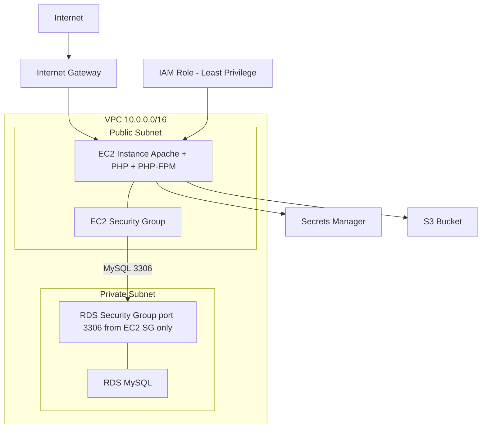

# Terraform AWS Infrastructure

## Overview
The Terraform codebase deploys an end-to-end PHP application server with a MySQL backend. The database is hosted in a private subnet and has no direct access to the internet.

The project also includes two API endpoints implemented using API Gateway and Lambda.
 
## Security
 
Security was the primary focus throughout this project. Key measures include:
 
- **Network controls** - properly configured Security Groups and NACLs across all subnets
- **Zero secrets in code** - no sensitive data exists in the Terraform configuration, application code, or user data script
- **GitHub Deploy Keys** - used for secure, read-only repository access during deployment
- **AWS Secrets Manager**  -database credentials and other secrets are stored and retrieved securely at runtime
- **AWS OIDC** - GitHub Actions authenticates with AWS using short-lived tokens, with no static credentials stored anywhere

--- 

## Architecture


--- 

## Terraform Environments
I wanted to avoid any code duplication across environments by using a single, consistent codebase. This ensures that when changes are merged into dev and pulled down locally, everyone is working from the same version of the infrastructure, keeping everything aligned and in sync.

I decided to implement this by creating an environments directory with individual tfvars files. 

This allows each environment to override the default variables and spin up independent infrastructure while still keeping the core configuration consistent.

To make changes to the Terraform code, I switch environments by reconfiguring the remote backend.

```
DEV
terraform init -reconfigure -backend-config="key=dev/terraform.tfstate" -var-file="environments/dev/dev.tfvars"
terraform plan -var-file="environments/dev/dev.tfvars"
terraform apply -var-file="environments/dev/dev.tfvars"

PROD 
terraform init -reconfigure -backend-config="key=prod/terraform.tfstate" -var-file="environments/prod/prod.tfvars"
terraform plan -var-file="environments/prod/prod.tfvars"
terraform apply -var-file="environments/prod/prod.tfvars"
```

---

## Key Decisions
- **Why I used user-data instead of CodeDeploy for initial bootstrapping**

  CodeIgniter requires an `.env` file containing the database credentials and base URL before the application can run. Rather than storing any credentials in the repository or codebase, I opted to handle the initial server setup via a user data script. 

  This allows the instance to copy the example `.env` file at launch and replace the placeholders with the correct values pulled from AWS Secrets Manager at runtime, ensuring no credentials are ever committed or exposed.

- **Why I chose Secrets Manager over Parameter Store**

  Although Parameter Store would have been sufficient, I chose Secrets Manager because it was the better fit for sensitive credentials. 

  It provides automatic encryption via AWS KMS out of the box, and crucially, supports automatic secret rotation, meaning credentials can be cycled on a schedule without any manual intervention or application downtime.

- **Why I used a deployment key instead of a personal access token**

  I chose a deploy key because it felt like the more appropriate tool for the job. A deploy key is attached directly to a single repository and can be set to read-only, so the EC2 instance can clone the code it needs and nothing else. 

  A PAT can also be scoped with fine-grained permissions, but it is still tied to a personal GitHub account, if that account were removed or suspended, the token would stop working. A deploy key lives at the repository level, keeping machine access separate from any individual user.

--- 

## Challenges & How I Solved Them
- **PHP Dependency Installation Issues**
  I ran into several problems when trying to install PHP dependencies with Composer inside the user-data script. After researching, I discovered that Composer behaves differently when run non-interactively (as root via user-data). 
  
    I had to set the correct environment variables and permissions so Composer could install packages successfully without user input.

- **User-Data Script Errors (String Replacement Issue)**
  
  In the user-data script, I used `sed` to replace placeholders in the `.env` file with the actual database credentials pulled from Secrets Manager. 
  
  This broke when the password contained special characters (like `$`, `&`, `/`, etc.), causing the string replacement to fail and leaving incorrect credentials in the `.env` file.

  I debugged the issue by SSHing into the instance and checking the `/var/log/cloud-init-output.log` file. Once I identified the problem, I replaced the `sed` command with a safer Python one-liner that properly handles special characters.

--- 

## Lambda Endpoints
I created **2 simple API endpoints** using API Gateway to invoke a Lambda function. For basic security, an API key is stored in AWS Secrets Manager, with each environment using a separate key to ensure isolation between dev and prod.

```
Description: Get basic project details
Type: GET
Endpoint: https://<api-id>.execute-api.eu-west-2.amazonaws.com/projects
Header: x-api-key

Description: Get basic health details
Type: GET
Endpoint: https://<api-id>.execute-api.eu-west-2.amazonaws.com/health
Header: x-api-key

Example Curl Request
curl --location 'https://<api-id>.execute-api.eu-west-2.amazonaws.com/projects' \
--header 'x-api-key: <provided separately>

```

## Github Actions Pipeline & Repo Configuration
To ensure the Terraform committed to `main` contains **no secrets** and avoids common **misconfigurations**, I implemented a CI pipeline that runs **Gitleaks** for secret scanning and **tfsec** for Terraform security/configuration checks.

As part of the repository configuration, I set up **branch protection** on `main`, enforced **pull requests** for all merges, and required **GitHub Actions checks** to pass before changes can be merged.

---

## Planned Improvements
- Implement JWT authentication or IP whitelisting for API endpoints to enhance security beyond API key-based access.
- Move all IAM roles and policies into Terraform to ensure permissions are fully version-controlled, consistent across environments, and no longer managed manually within the AWS console.
- Add rate limiting to the API endpoints to help protect against abuse, control traffic spikes, and improve overall API stability and security.

--- 

## Tech Stack
HCL, Linux, Python, Bash